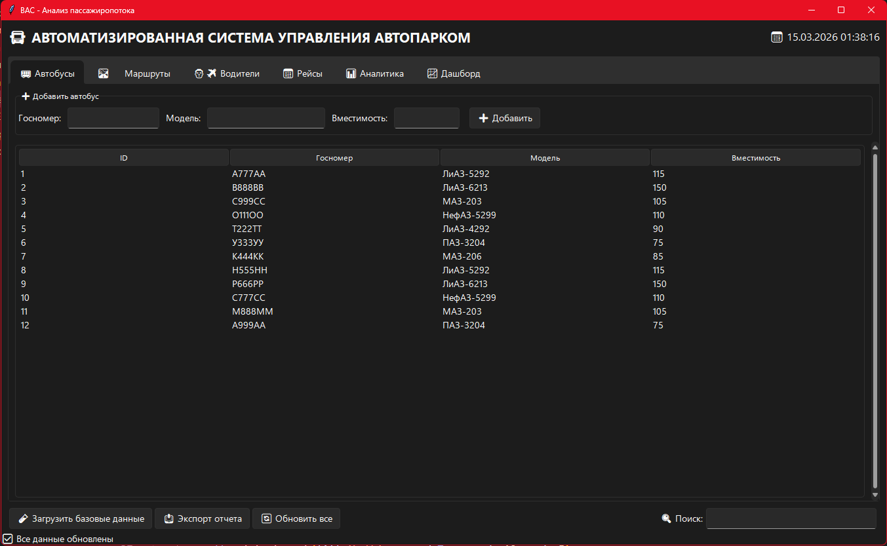
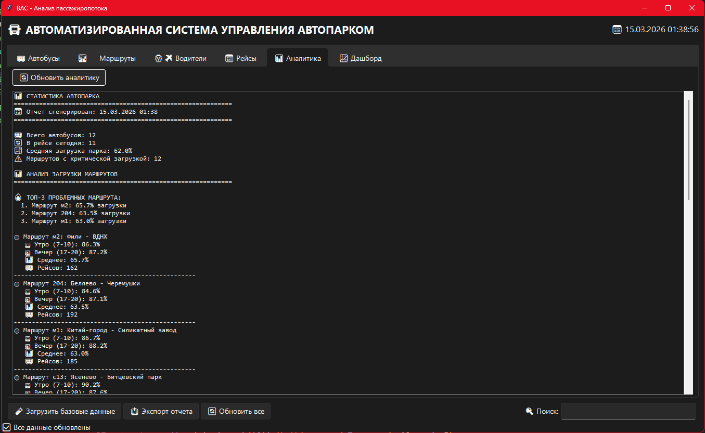
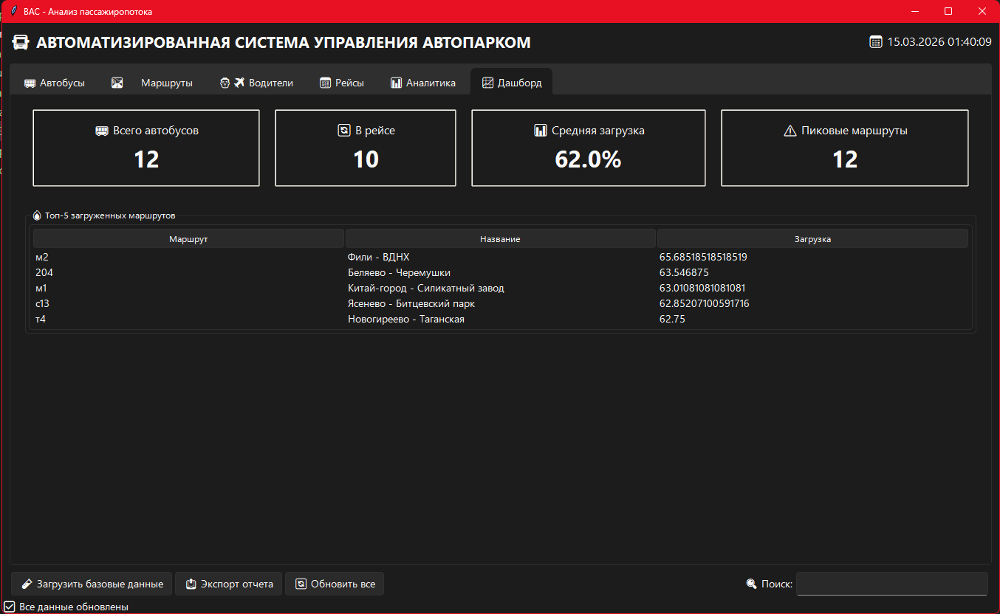
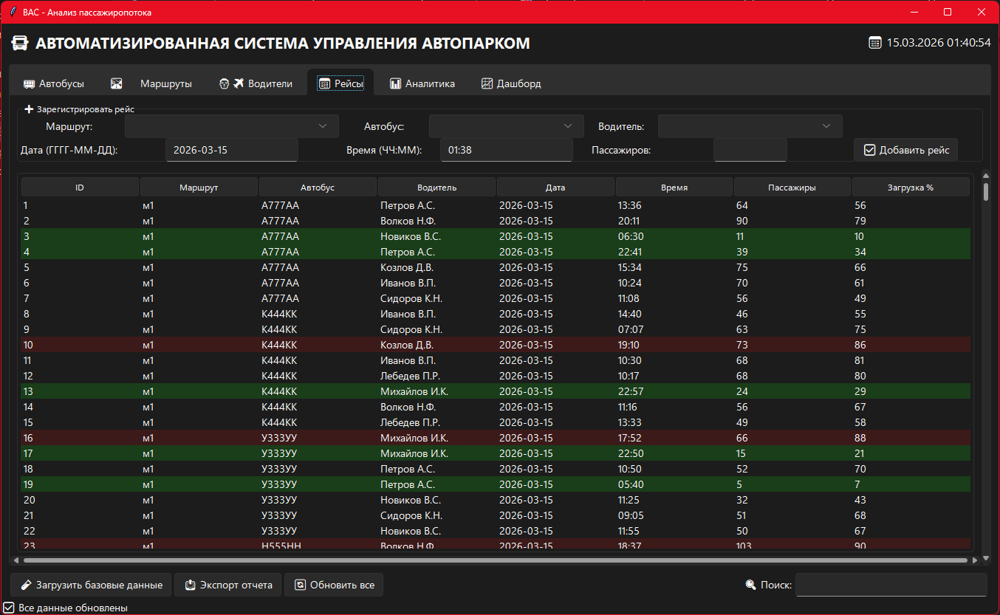

# BAC Автопарк - Анализ пассажиропотока


**Проектирование и разработка приложения для автоматизации анализа пассажиропотока и распределения автобусов по маршрутам**

Десктоп-приложение для автоматизации учёта и анализа работы автобусного парка. Разработано в рамках курсовой работы по специальности 09.02.07 «Информационные системы и программирование».

## 🎯 Функциональность

### Учёт и справочники
- **Автобусы**: Госномер, модель, вместимость.
- **Маршруты**: Номер маршрута, название (реальные маршруты Москвы).
- **Водители**: ФИО, номер водительского удостоверения.

### Оперативный учёт
- **Рейсы**: Регистрация рейсов с привязкой к автобусу, маршруту и водителю.
- **Автоматический расчёт**: Процент загрузки на основе вместимости автобуса.
- **Цветовая индикация**: Красный (>85%), зелёный (<40%) в таблице рейсов.

### Аналитика и отчёты
- **Загрузка маршрутов**: Детальный анализ по утренним (7-10) и вечерним (17-20) часам.
- **Топ-5 маршрутов**: Самые загруженные направления.
- **Рекомендации**: Автоматическая генерация советов по распределению автобусов.
- **Дашборд**: Ключевые метрики парка (всего автобусов, в рейсе, средняя загрузка).

### Дополнительно
- **Поиск**: Быстрый поиск по всем таблицам.
- **Экспорт**: Сохранение отчётов в текстовый файл.
- **Тестовые данные**: Предзаполненная база с реалистичными данными Москвы.

## 🛠 Технологический стек

- **Язык**: Python 3.11+
- **GUI**: Tkinter/ttk 
- **База данных**: SQLite 3
- **Аналитика**: Встроенные алгоритмы на Python
- **Дополнительно**: sv_ttk (опционально, для тёмной темы)

## 📦 Установка и запуск

### Локальный запуск

1. **Клонируйте репозиторий**
```bash
git clone https://github.com/your-username/bus-analysis-coursework.git
cd bus-analysis-coursework
```

2. **Установите зависимости**
```bash
pip install -r requirements.txt
```

3. **Запустите приложение**

```bash
python main.py
```

При первом запуске база данных создастся автоматически и заполнится тестовыми данными (маршруты Москвы).


## 📂 Структура проекта

```
bus-analysis-coursework/
├── main.py              # Точка входа, графический интерфейс
├── database.py          # Работа с SQLite (CRUD операции)
├── analytics.py         # Логика аналитики и рекомендации
├── reports.py           # Формирование текстовых отчётов
├── requirements.txt     # Зависимости проекта
├── bus_company.db       # База данных (создаётся автоматически)
└── screenshots/         # Скриншоты для README
    ├── main_window.png
    ├── analytics.png
    └── dashboard.png
```

## 📊 Пример аналитики
### После загрузки тестовых данных система выдаёт:

```
📊 СТАТИСТИКА АВТОПАРКА
============================================================
🚌 Всего автобусов: 12
🔄 В рейсе сегодня: 11
📈 Средняя загрузка парка: 62.0%
⚠️ Маршрутов с критической загрузкой: 1

🔥 ТОП-3 ПРОБЛЕМНЫХ МАРШРУТА:
  1. Маршрут с13: 62.9% загрузки
  2. Маршрут м2: 62.8% загрузки
  3. Маршрут 204: 62.5% загрузки

💡 РЕКОМЕНДАЦИИ:
  🔴 Маршрут с13: КРИТИЧЕСКАЯ загрузка в пик (90%). Требуется срочное усиление!
```

## 📸 Скриншоты

### Главное окно


### Аналитика


### Дашборд
	

### Рейсы


## 🧪 Тестовые данные
### В программе предустановлены:
**12 маршрутов Москвы: м1, м2, т4, 716, 204, 144, Т47, с13, 835, 877, 951, 309
12 автобусов: ЛиАЗ-5292, ЛиАЗ-6213, МАЗ-203, НефАЗ-5299, ПАЗ-3204 и др.
10 водителей с номерами прав
500+ рейсов за неделю с распределением по часам пик

## 📄 Экспорт отчётов
### При нажатии кнопки «📤 Экспорт отчета» генерируется файл формата:
```
report_20260315_143022.txt
```
### Содержащий полную статистику и рекомендации по всему парку.

## 🎓 Курсовая работа
Данный проект выполнен в рамках курсовой работы по МДК.02.01 «Технология разработки программного обеспечения» (ПМ.02 «Осуществление интеграции программных модулей»).
### Тема: «Проектирование и разработка приложения для автоматизации анализа пассажиропотока и распределения автобусов по маршрутам»

## 👨‍💻 Автор
Kirill Bukarev
GitHub: @bukabtw